# What drives the price of a car?
A detailed review of the key elements impacting the price of a car


## Overview

In this application, we will explore a dataset from kaggle. The original dataset contained information on 3 million used cars. The provided dataset contains information on 426K cars to ensure speed of processing. The goal is to understand what factors make a car more or less expensive. As a result of the analysis, we'll provide clear recommendations to a used car dealership as to what consumers value in a used car.


# Methodology used 

The CRISP-DM (CRoss Industry Standard  Process  for  Data  Mining)  project addressed  parts  of these  problems  by  defining  a  process  model  which  provides  a  framework  for  carrying  out  data mining  projects  which  is  independent  of  both  the  industry  sector  and  the  technology  used.  The
CRISP-DM  process  model  aims  to  make  large  data  mining  projects,  less  costly,  more  reliable,
more repeatable, more manageable, and faster.


## Business Understanding

As a used car dealer, it is important to understand what factors are the differentiators that make a car more or less expensive. As a result of exploring the data provided (426,000 used car sales records), I will need to guide the dealer through different reports to make good decisions on how to improve their inventory and/or potentially their sales.

## Data Understanding

As a first step, It is important to understand the data provided. The original data used into my process is of a size of 426K sale records of used cars. The following is a overview of the data. 

** This overview is generated by a profiling library `ProfileReport` from `ydata_profiling`


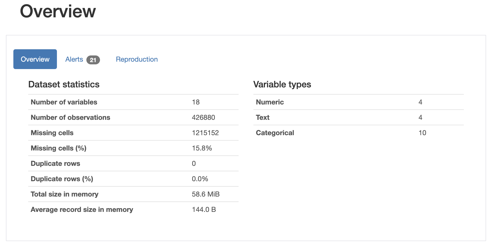

#### Missed columns

During the review of data this is identified the empty or null cells. The following is a heatmap visualization showing us the distribution of empty values.

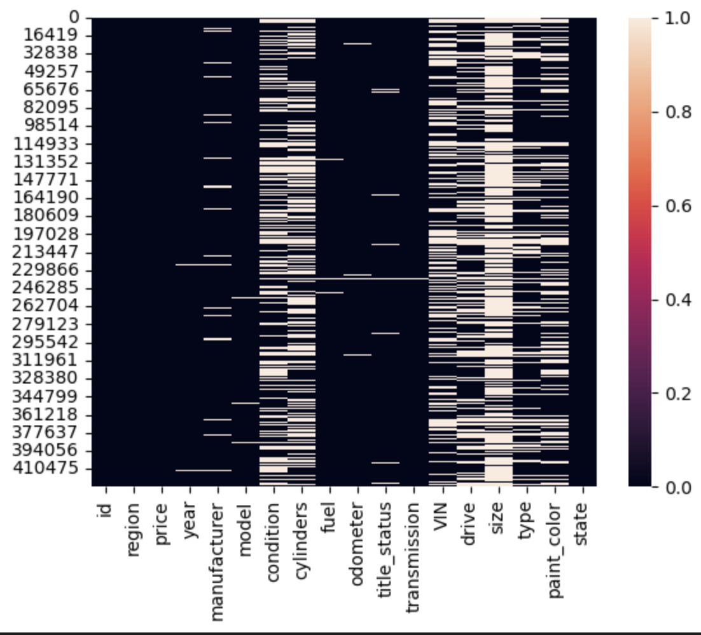

#### Columns, Missed percentage and actions necessary:

- `id`:
    - This is a unique value. 
    - Action: Delete this column as we can't use this into regressions

- `region`:
    - Name of the region where reported the transaction. 0% of missed records
    - Action: None

- `price`:
    - Sales price for the car. 7.7% of the records are with zero. 
    - Action: Remove records with zero value as this is necessary for predictions

- `year`:
    - Year of the car. 0.3% missed records
    - Action: Filling with the most common value

- `manufacturer`:
    - Name of the manufacturer. 4.1% of records missed
    - Action: Filling with "Other" as this is a categorical column

- `model`:
    - Name of the model for car sold. 1.2% of records missed  
    - Action: Filling with "Other" as this is a categorical column

- `condition`:
    - Status of car when sold. Missed records 40.8%
    - Action: Filling with the most common value

- `cylinders`:
    - Missed record 41.6 %
    - Action: Remove the word cylinders, Replace others and missed values by filling with the most common value

- `fuel`:
    - Missed records 0.7%
    - Action: Filling with "Other" as this is a categorical column

- `odometer`: 
    - Odometer when sold vehicle. 1% missed
    - Action: Filling with odometer mean

- `title_status`:
    - This represents the status of the title of car. 1.9%
    - Action: Filling with the most common value

- `transmission`:
    - Missed records 0.6 %
    - Action: Filling with "Other" as this is a categorical column

- `VIN`:
    - Must be an unique value by car. Missed 37.7%
    - Action: Remove column because this can not be used into regression

- `drive`:
    - Missed records 30.6%
    - Action: Delete this column because missed records percentage

- `size`: 
    - Classification for size of vehicle. There are 71.8% of records missed. 
    - Action: Delete this column because missed records percentage

- `type`:
    - Missed records 21.8%
    - Action: Filling with "Other" as this is a categorical column

- `paint_color`:
    - Missed records 30.5%
    - Action: Delete this column because missed records percentage

- `state`:
    - Administrative area - State
    - Action: None

## Data Preparation

### Missing values - Treatment

During the "Data Understanding" process were identified the percentage of missed values per column, this was ientified the categorical columns and the most important, the action necessary to fix the missed values by deciding between:
- Remove the column
- Fill with "other" for categorical columns
- Fill with the "mean" 
- Fill with the most common value

Additionally, over categorical values, this was identified columns with values to be fixed like:
- paint_color: replace "7" with "other"
- manufacturer: replace "33" with "other"

Here the data fixes applied:

- Removing records with price = 0:
    - df_clean = df_indexed.query('price > 0')

- Droping VIN because this should be unique but there is a high number of missed values`
    - df_clean = df_clean.drop(['id', 'VIN', 'region', 'size', 'paint_color', 'drive'], axis=1)

- Filling criteria:
    - df_clean["year"] = df_clean["year"].fillna(df_clean["year"].mode()[0])
    - df_clean['year'] = df_clean['year'].apply(lambda x: int(x))
    - df_clean["manufacturer"] = df_clean["manufacturer"].fillna('other')
    - df_clean["model"] = df_clean["model"].fillna('other')
    - df_clean["condition"] = df_clean["condition"].fillna(df_clean["condition"].mode()[0])
    - df_clean["cylinders"] = df_clean['cylinders'].str.replace(' cylinders', '')
    - df_clean["cylinders"] = df_clean["cylinders"].fillna(df_clean["cylinders"].mode()[0])
    - df_clean["cylinders"] = df_clean['cylinders'].str.replace('other', df_clean["cylinders"].mode()[0])
    - df_clean["fuel"] = df_clean["fuel"].fillna('other')
    - df_clean["odometer"] = df_clean["odometer"].fillna(df_clean["odometer"].mean())
    - df_clean["title_status"] = df_clean["title_status"].fillna(df_clean["title_status"].mode()[0])
    - df_clean["transmission"] = df_clean["transmission"].fillna('other')
    - df_clean["type"] = df_clean["type"].fillna('other')
    - df_clean['model'] = df_clean['model'].str.replace('-', '')

- Special adjustment for model column (Using method extracting first word):
    - df_clean['model'] = df_clean.apply(first_words, axis=1)

- Removing duplicated records
    - df = df_clean.drop_duplicates()


### Reviewing results after cleaning:

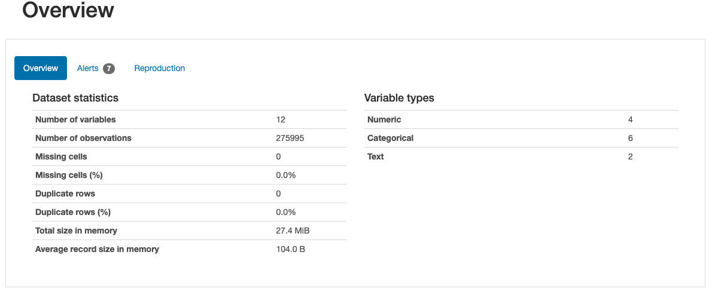

As described with the results above, the data has being prepared by removing all the missed values and removing duplicates as needed.


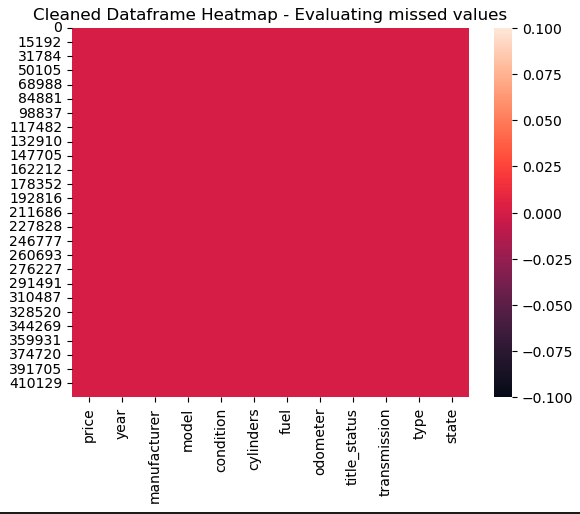

### Identifying Outliers

We can use the IQR to determine boundaries for outliers.  One such rule of thumb is that any values $1.5 \times IQR$ above the third quartile or below the first are considered outliers.  

Calculate the lower and upper boundaries for outliers for the `price` column using the IQR rule.
```
def outliers_filter(df, column):
    factor = 1.5
    first_quartile = df[column].quantile(.25)
    third_quartile = df[column].quantile(.75)
    iqr = third_quartile - first_quartile
    lower = first_quartile - factor*iqr
    upper = third_quartile + factor*iqr
    print( f' lower: { lower }, upper: { upper }')
    return

outliers_filter(df, 'price')
```

Suggested after calculation:
```lower: -21250.0, upper: 52750.0```

Price values to use as a safe range: ```100 - 70000```

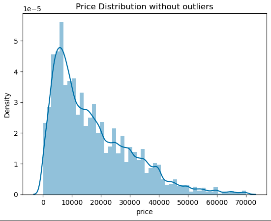


## Modeling

I executed multiple regressions looking for the best model based on the error resulting from training predictions and testing dataset:

1. Simple Linear Regression
2. Linear Regression with Polynomial Features using a GridSearchCV (Cross validation)
3. Ridge Regression with Polynomial Features using a GridSearchCV (Cross validation)
4. Lasso Regression with Polynomial Features using a GridSearchCV (Cross validation)
5. Linear Regression with SequentialFeatureSelector using a GridSearchCV (Cross validation)


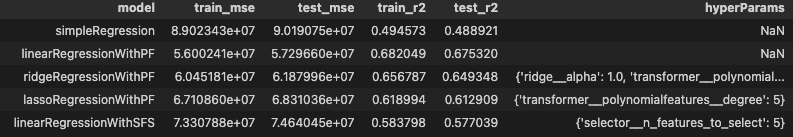

Based on the results above the best model fitting the data provided is the LinearRegression with polynomial features. The resuls are confirmed by comparing ALL the models over the test mse and the test r2. While the MSE is lower the R2 is higher representing the best model

## Evaluation

### Evaluating MSE
Let us compare in detail the resulting error frm the Training and Testing data sets

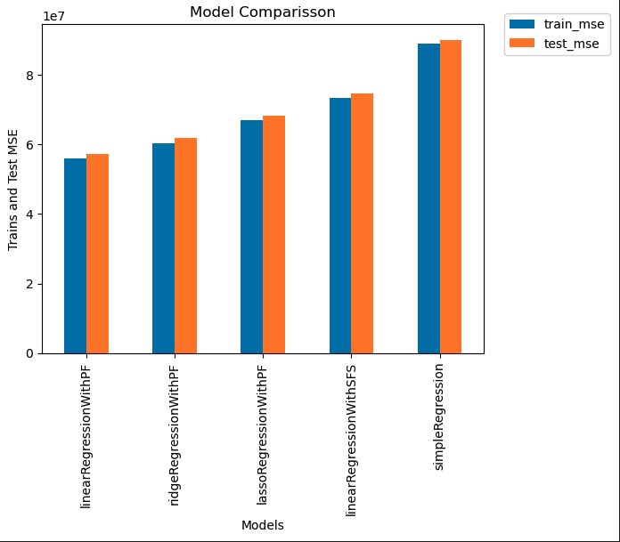

The image above confirm to us the `Linear Regression with Polynomial Features using a GridSearchCV (Cross validation)` product the minor resulting error by evaluating the MSE.

### Evaluating R2
Let us compare using the R2 error:
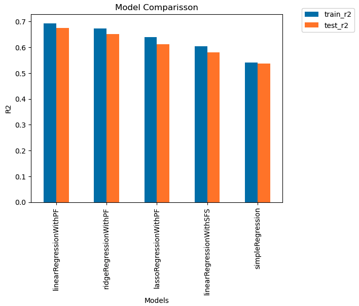

Through this visualization we could confirm the higher R2 is related to the `Linear Regression with Polynomial Features using a GridSearchCV (Cross validation)` confirming this as the best model to use in comparisson with the other regressions performed

### Features importance

After doing a `Permutation Importance` the following are the features identified as generating more impact to the `Car Price`:

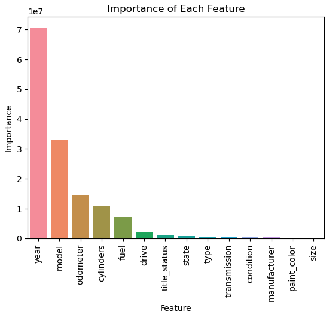

Once the data has being evaluated, the year, model, odometer and cylinders raise as the most relevant features when defining the `Price` for a car. The `Car's Year` is the most impacting feature making sense to devaluating of cars. The car is most expensive when new or when this is a `Vintage` car.

### Data Correlation

Using the most important features, I would like to show the relation between Price and other features:

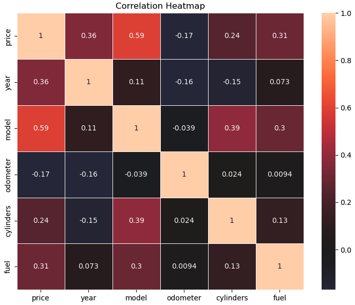

Based on correlation, the model is one showed as highly correlated with price while the odometer have the most negative correlation. The last one denoting while the Odometer goes up, the price goes down. A car with higher odomoter lose value. This is important to get inventory of vehicles with lower mileage.

## Deployment

In order to improve the results, I would like to categorize some attributes as following:

#### Categorizing Year
I would like to classify cars based on the year into the following categories:

- `Vintage`: Manufactured between 1919 and 1930. Either a “survivor” or restored in conformance to the original manufacturer specifications
- `Antique`: Manufactured 1975 or earlier (>45 years old). Either a “survivor” or restored in conformance to the original manufacturer specifications
- `Classic`: Manufactured 2000 or earlier (>20 years old)
- `Modern` : Manufactured 2000 or earlier (>10 years old)
- `New Model`  : Manufactured 2017 or newest (5 years old) 

#### Categorizing Odometer
In the same way as with year, I would like to classify cars based on odometer by using the following levels:

- `New`: Less than 15K miles
- `Low`:  Between 15K and 40K miles
- `Medium`: Between 40K miles and 70K miles
- `High`: More than 70K miles


#### Data classification

Once defined the above ranges, the original data is classified generating new features based on those criterias:

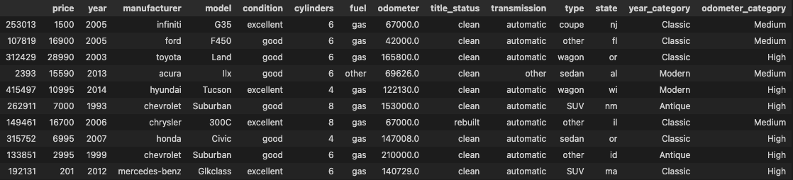


### Prices by year category vs fuel type

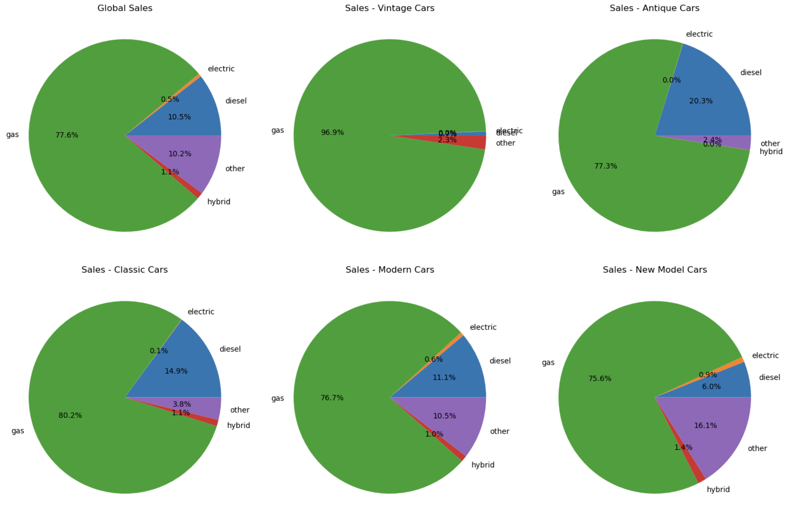

- Historically `gas` vehicles represents the best value
- An slightly increase of `Hybrid` cars has being present during the year categories. We must consider this as a technology recently in adoption masively


### Total price by manufacture year

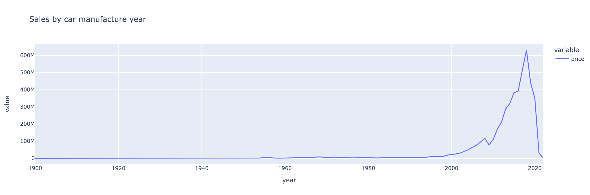

This is notable the major prices has being reported for car's manufacture on `2018`. As we have data until 2022, this could be an interesting fact indicating us the preference for consumers for used cars is NOT older than 4 year, being 4 the best option.

### Using Top 10 models, retrieve car manufacture 2018

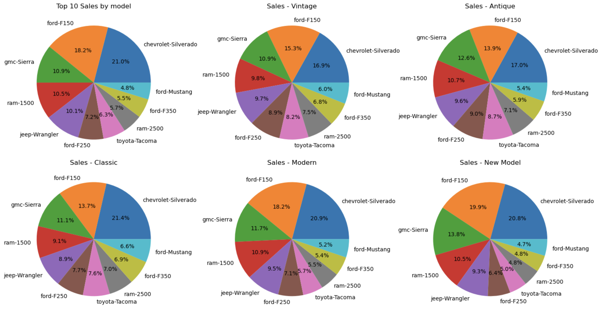

- Chevrolet Silverado and Ford F-150 raise as the models with best price over the analyzed data. Those models keep their presence over data when comparing different year categories.
- As recommendation, those models are the most attactive for the market

### Top 10 Models evaluating Odometer

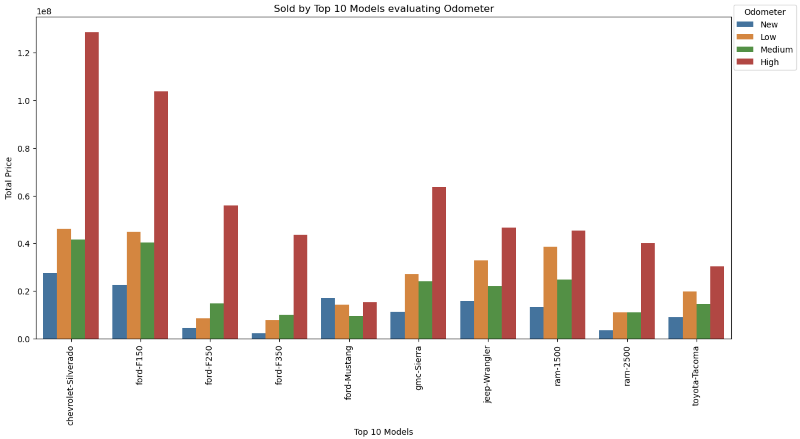

Looks like the target consumer is NOT interested in vehicles relatively new or with low odometer. The price total for vehicle with high odometer represent the major prices mainly over the top two models: Chevrolet Silverado and Ford F150.


### Evaluating 2018 (Most priced cars) and the distribution of top models & Odometer

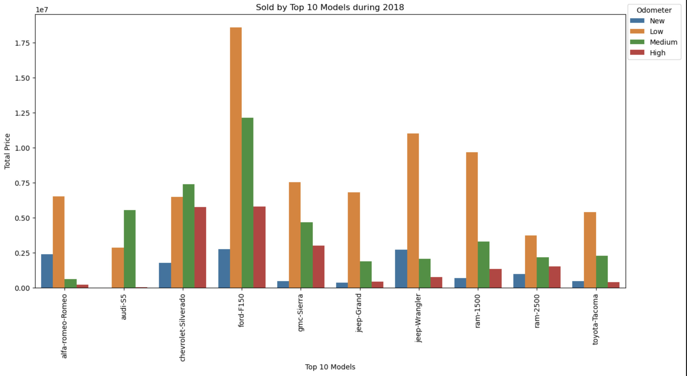

When going deeper over the data for vehicles manufactured on 2018, I found the Ford-F150 as one of the best option for customers. They are looking Ford-F150 with Low and Medium mileage mainly.

#### Price for cars manufactured 2018 by model

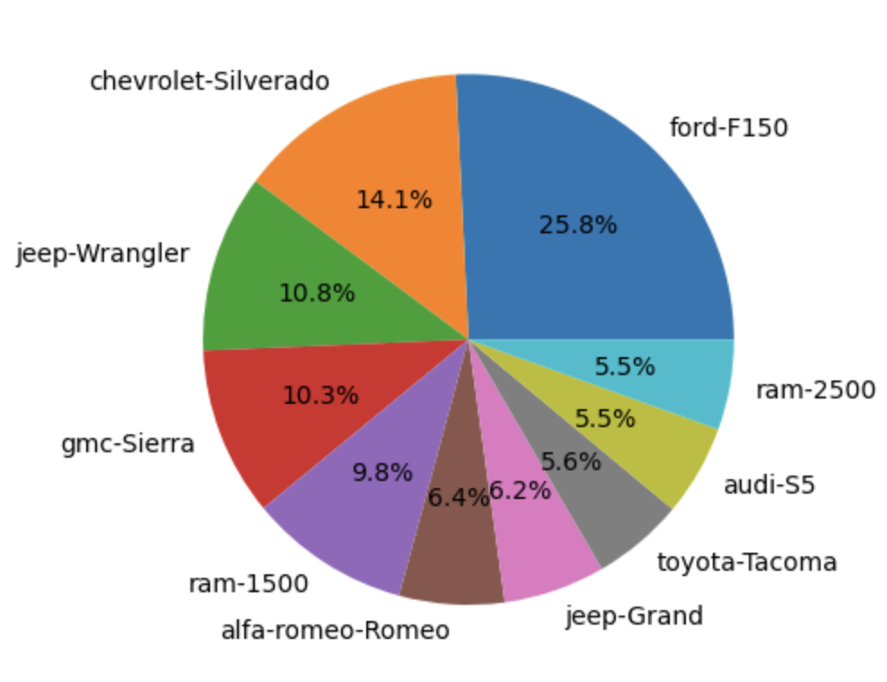

This graph complements the previous data as we could see here what are the most priced models manufactured on 2018. We found Ford-F150 and Chevrolet Silverado in the TOP 2. Being the Ford-150 representing almost the double of the second place.


## Findings

1. Vehicles manufactured 4 year's ago are the most prefered option for consumers
2. Keeping an inventory of Ford F150 and Chevrolet Silverado is benefitial for your business as this represents the best prices historically
3. You business should look for used vehicles with mileage as following:
    - Ford F150: Low - high
    - Chevrolet Silverado: Medium to high
4. A potential transition to hybrid or eletric could come in the future, however there is not significatively impact at this moment based on your data.
5. The fuel preference over the top vehicles is Gas. And this reflects the type of vehicle. Ford F150 and Chevrolet Silverado are trucks and it is probable the perform better with gas.
6. The major density of sales are for vehicles with price between $6,000 and $20,000. You can consider vehicles with higher odometer to supply inventory in this price range, using the premise of higher odometer the price is reduced.


## Next steps and recommendations

1. To implement more models with different cross validation techniques looking to improve the errors.
2. Improve the data quality as this was necessary to perform multiple actions over the original data source by reducing it significatively.
3. Add more plots evaluating the data from more angles.
4. Test the model by predicting values by new entries.